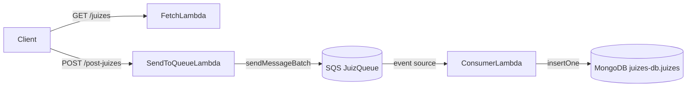

# aws-juiz-service: serverless referee-stats service (AWS CDK, TypeScript)

Study project that models an event-driven service for football-referee statistics on AWS, written as infrastructure as code with the **AWS CDK in TypeScript**.

## Architecture



- **`FetchLambda`** (`lambdas/fetch-juizes.ts`): returns referee records (mock data) through API Gateway.
- **`SendToQueueLambda`** (`lambdas/send-to-queue.ts`): takes a JSON array from the request body and sends it to SQS in one batch. It has permission to send messages and receives the queue URL as an environment variable.
- **`ConsumerLambda`** (`lambdas/consumer.ts`): triggered by SQS; stores each message in MongoDB.

**Stack:** TypeScript · AWS CDK · AWS Lambda (Node.js 18) · Amazon SQS · Amazon API Gateway · MongoDB

## Commands

```bash
npm install
npm run build    # compile TypeScript
npx cdk synth
npx cdk deploy
```

## Status

Learning project (May 2025), not deployed. Before a real deployment: set `MONGO_URI`, bundle the `mongodb` driver, move the Lambdas to AWS SDK v3 (v2 is not included in the Node.js 18 runtime), and split requests larger than 10 items, which is the SQS batch limit.

A more complete JavaScript version, with DocumentDB, CORS and partial-batch failure handling, lives in [final-juiz](https://github.com/BeatrizVocurcaFrade/final-juiz).
